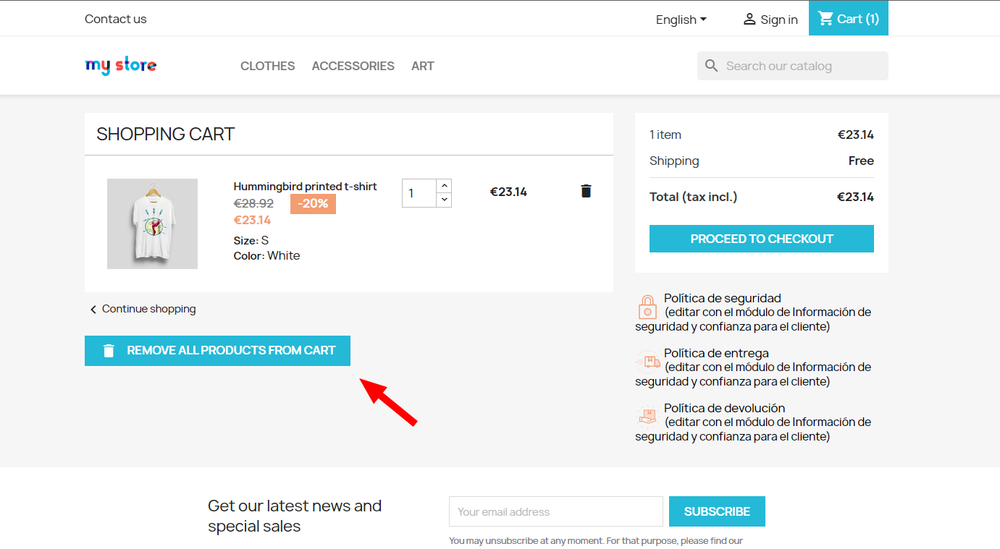
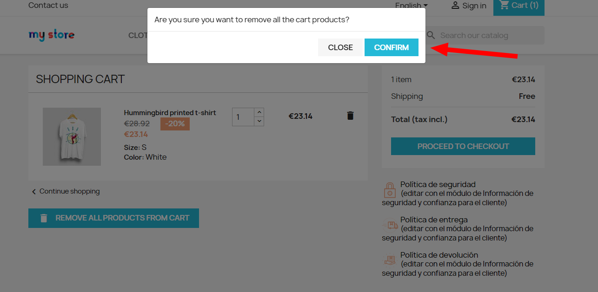
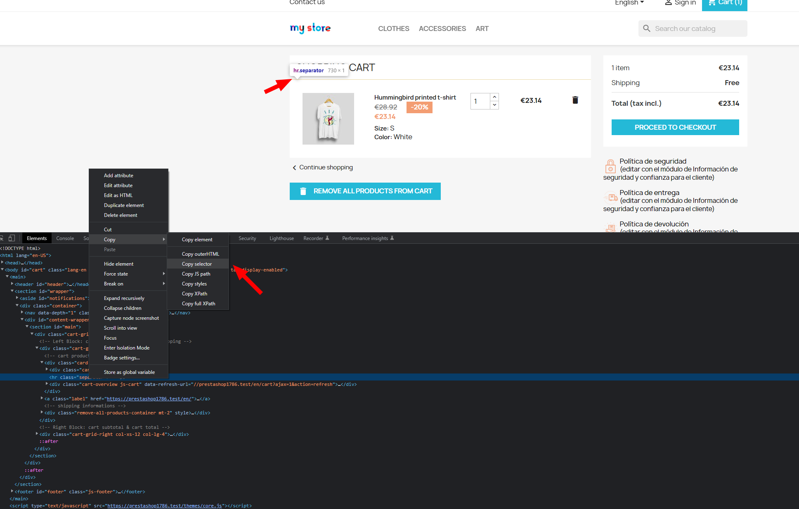
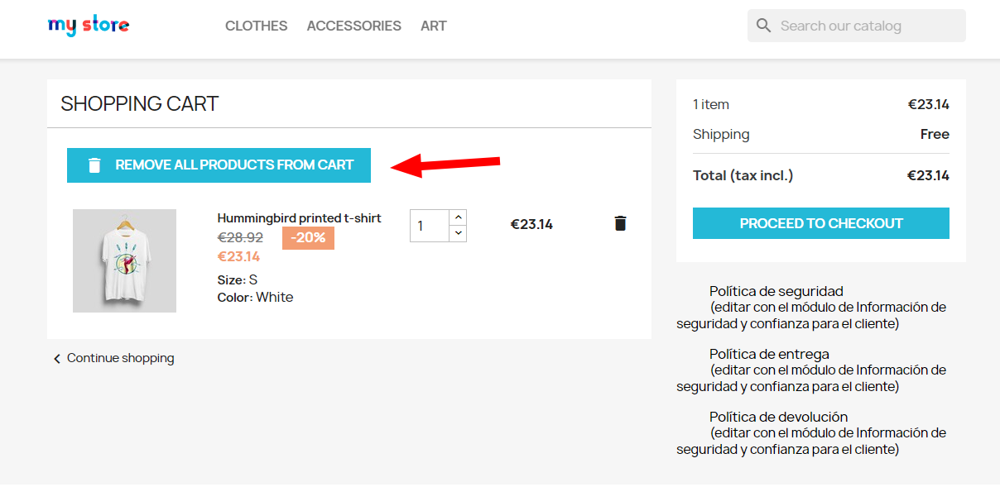

# Empty Cart button module for Prestashop

## Table of contents

- [Information](#information)
- [Requirements](#requirements)
- [Setup](#setup)
- [Usage](#usage)
    - [Show confirmation modal](#show-confirmation-modal)
    - [HTML reference](#html-reference)
    - [HTML classes](#html-classes)
- [License](#license)

## Information

This module adds a button to remove all the cart products in the cart page:

## Requirements

PrestaShop 1.7.8.6 or higher. Not tested on previous versions.

## Installation

You could install this module through FTP or using the Prestashop backoffice (https://addons.prestashop.com/en/content/21-how-to).

## Usage

### Show confirmation modal

You could enable a confirmation modal before delete all cart products:

### HTML reference

If you want to change the button positon you could use an HTML selector. In order to obtain this selector, you could use the browser inspector. For example:

By adding this selector to the configuration you will change the button position after the selected element:

### HTML classes

It is possible to add new classes to the button container, enabling you to give it styles. For example, you could use the Bootstrap "mt-2" class to add margin on the top.

## License

GNU General Public License version 3

EmptyCart for prestashop is free software: you can redistribute it and/or modify it under the terms of the GNU General Public License as published by the Free Software Foundation, either version 3 of the License, or (at your option) any later version.

EmptyCart for prestashop is distributed in the hope that it will be useful, but WITHOUT ANY WARRANTY; without even the implied warranty of MERCHANTABILITY or FITNESS FOR A PARTICULAR PURPOSE. See the GNU General Public License for more details.

You should have received a copy of the GNU General Public License along with EmptyCart for prestashop. If not, see http://www.gnu.org/licenses/.
